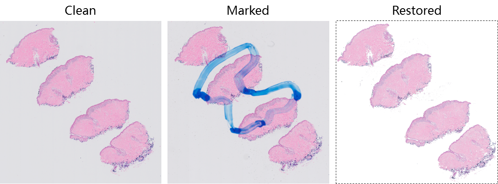
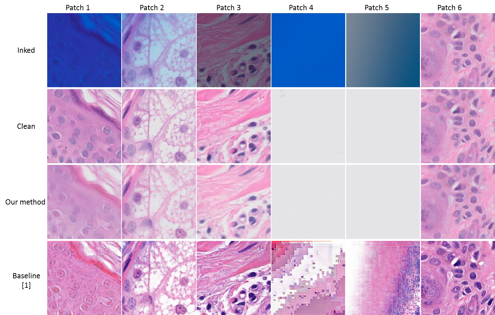
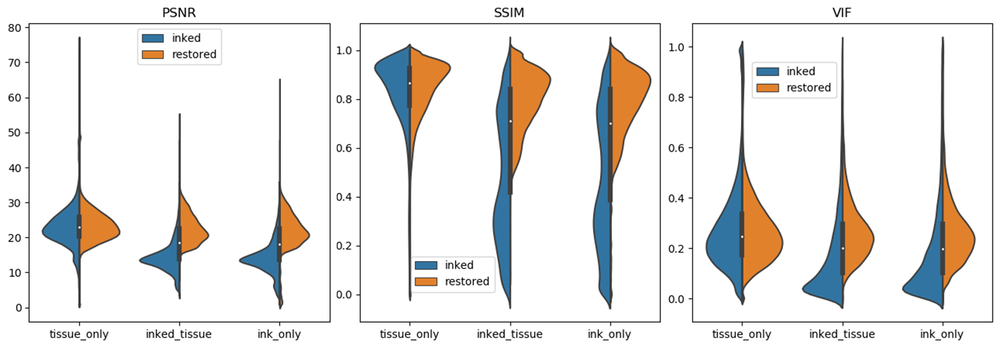

Deep learning models are showing promise in digital pathology to aid diagnoses. 
Training complex models require a significant amount and diversity of well-annotated data, typically housed in institutional archives. 
These slides often contain clinically meaningful markings to indicate regions of interest. 
If slides are scanned with the ink present, then the downstream model may end up looking for regions with ink before making a classification. 
If scanned without the markings, the information is lost about where the relevant regions are located. 

In this repo, we proposed a straightforward framework to digitally remove ink markings from whole slide images using a conditional generative adversarial network, opening the possibility of using archived clinical samples as resources to fuel the next generation of deep learning models for digital pathology.   
Please read our paper to get more details. If you find this repo helps you, please cite our work:
```
@article{jiang2020,
  title={Image-to-Image Translation for Automatic Ink Removal in Whole Slide Images},
}
```

Here is an example of WSI showing the clean scan, marked slides and image after restoration.  
 
Here are some high resolution image patches to show performance of image restoration .

In order to evaluate the effectiveness of our workflow, violin plots were drawn to enrich our assessment. 
We can observe: First, the distributions of all evaluation metrics for tissue_only patches are symmetrical, which indicates that our model preserves the image content if no ink presents. 
Second, for patches with ink (inked_tissue and ink_only), all three evaluation metrics move to higher values, which indicates ink was effectively removed. 
Particularly, for image patches with ink, SSIM distributions were dispersive before ink removal (which may be caused by uneven thickness of ink), but aggregate to higher values, which indicates inked image patches were effectively restored.


## Installation
* Clone our code 
```
git clone https://github.com/smujiang/WSIPenMarkingRemoval.git
```
* Install the dependencies
```
conda install tensorflow-1.14 numpy-1.15 PIL seaborn pandas
```
> You may also need to install our [wsitools]() to enable our patch extraction sub-module.

## Run our workflow
* Step 1 [optional]. Prepare your own dataset   
    Since the volume of image data for this research is huge, we only provide very few image samples in [this directory](./img_samples). （Image size: 512x256 px, pixel size: 0.25μm) 
    
    You may need to extract patches from WSIs, depend on if you would like to run on your own dataset.  
    If you would like to train your own model, you need to prepare some clean and marked image pairs. Please refer to our [pairwise patch extraction code](./patch_extraction/extract_pairs.py), and [image samples](./img_samples)   
    If you would like to test our pre-trained model, you just need marked WSIs for testing. Please refer to our [marked WSI extraction code](./patch_extraction/extract_marked.py). and [image samples](./img_samples) (Fill the left 256*256 part of the image with pure white, if you don't have clean slides as counterparts.) 

* Step 2 [optional]. Train the model   
    Please refer to this [bash script](./pix2pix/training.sh) to train the ink removal model. You may need to modify some code to load the data for model training.

* Step 3. Testing the model  
    Please refer to this [bash script](./pix2pix/eval.sh) to evaluate the model. You can test your own model (follow step 2 to train your model), or run our pre-trained model which can be downloaded from [Google Drive](https://drive.google.com/open?id=1iFKdA-I2Ms_CzhYY9naHfYAR2xrz4ria).

* Step 4. Reconstruct the image from restored patches  
    Please refer [our code](./post_proc/patch_blending.py) for patch reconstruction 

* Step 5 [optional]. Quantitative evaluation    
    Evaluation metrics can be calculated with code in ./eval

### References
[1] S. Ali, N. K. Alham, C. Verrill, and J. Rittscher, "Ink removal from histopathology whole slide images by combining classification, detection and image generation models," arXiv preprint arXiv:1905.04385, 2019.

[2] Venkatesh, Bairavi, Tosha Shah, Antong Chen, and Soheil Ghafurian. "Restoration of marker occluded hematoxylin and eosin stained whole slide histology images using generative adversarial networks." arXiv preprint arXiv:1910.06428 (2019).


